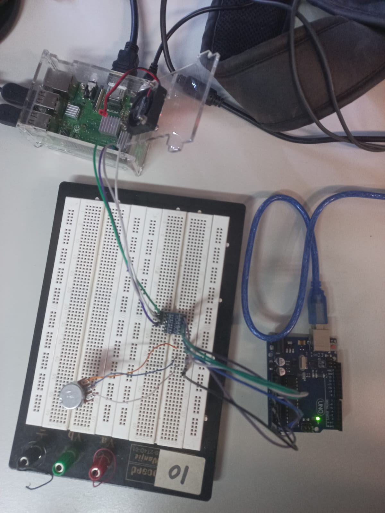

<h1> Prática 5 - SEL0337 </h1>

# Protocolos de comunicação em sistemas embarcados

A presente prática consiste em aplicar a comunicação I2C entre Rasp Pi e um microcontrolador, nesse caso o Arduino Uno.

A partir da requisição da Rasp Pi, o projeto implementado realiza a transferência de uma leitura analógica do Arduino (feita em um potenciômetro) e exibe o valor lido no terminal do arduino e no terminal do SO da Rasp Pi.

## Montagem do circuito

Como o pino de comunicação serial do Arduino opera com nível alto em 5V enquanto a comunicação serial da Rasp Pi opera com 3,3V, é necessário o uso de um level shifter 5V-3,3V. Por esse motivo, é necessário conectar uma referência do ground e do high state de ambos os dispositivos, além do clock line e da data line.

A montagem realizada está exibida na figura abaixo.

A imagem é idêntica àquela do circuito por nós implementado, porém a lembrança de se realizar tal registro fotográfico foi perdida no esquecimento e por esse motivo recorremos ao registro feito por nossos colegas.

## Códigos

Embora a resolução da leitura analógica seja de 10 bits, o protocolo I2C utilizado manda um byte de cada vez. Dessa forma, no código .ino duas mensagens são enviadas com a função Wire.write(), uma vez com o highByte (8 bits mais significativos) e outro com o lowByte (8 bits menos significativos).

Por esse motivo, os valores obtidos na requisição da Rasp Pi precisam ser reconvertidos em um inteiro, conforme é feito pelas seguintes linhas de código:

    data = bus.read_i2c_block_data(addr, 0, 2)    
    Tensao = 256*data[0]+data[1]    

Finalmente, o valor convertido em float (representando tensão de 0 a 5V) é printado nos terminais da Rasp Pi e do Arduino IDE. Nesse último o valor inteiro da leitura (de 0 a 1023) também é printado.

**Obs: Os códigos utilizados na prática estão presentes neste repositório com comentários que melhor detalham o funcionamento.**

**PS: na linha 100 em diante de cada código tem uma mensagem muito importante**